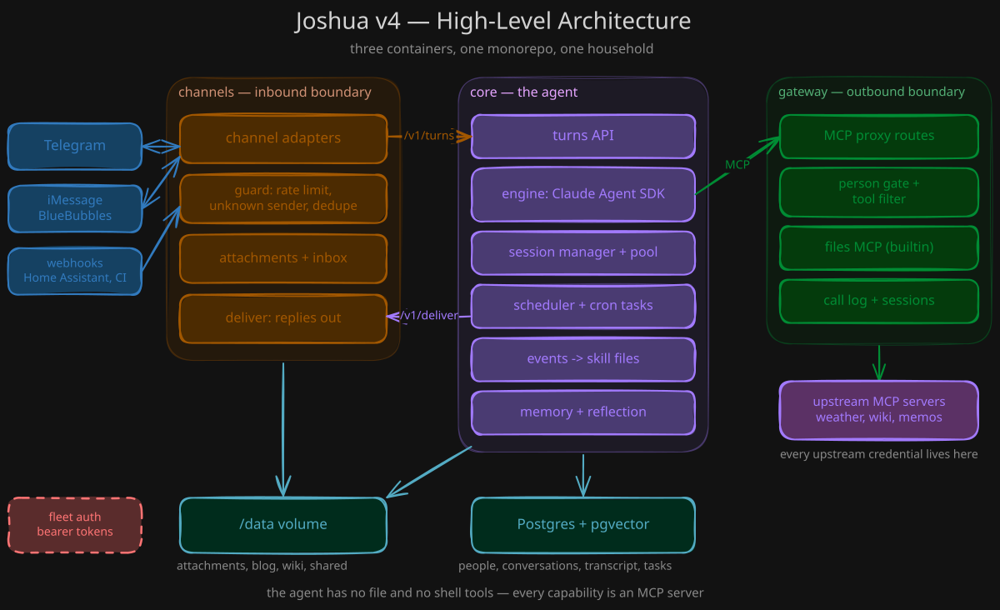

# Joshua v4

Joshua is a personal AI agent for one person or a small group of people who
share it: a family, friends, a team. v4 rebuilds it into three containers that ship
from one monorepo and one `docker-compose.yml`. The three containers are
`channels` (the inbound trust boundary), `core` (the agent, memory, and
scheduling), and `gateway` (the outbound trust boundary that holds every
upstream credential). A shared package, `joshua_shared`, holds the code the
three containers use.

The same code runs on Kubernetes and on one Docker host with a Claude
subscription. One instance serves one group of people. The design keeps
the agent's power low: it has no file tools and no shell, and it reaches the
world only through `channels`, through `gateway`, and through the Claude Agent
SDK web tools.

## Architecture



A message enters through `channels`, which authenticates the platform, applies
the allowlist and the rate limits, and stores any attachment. `channels` sends a
normalized turn to `core`. `core` runs the agent, keeps the session, and reaches
every tool through `gateway`. The reply goes back out through `channels`.

`core` holds the database and the data volume. `gateway` holds every upstream
credential, and applies the per-person tool policy. The agent has no file tools
and no shell: each capability is an MCP server behind `gateway`.

## Start here

[docs/quickstart.md](docs/quickstart.md) takes you from nothing to a
conversation with Joshua in about fifteen minutes. You need Docker and a Claude
subscription. You do not need Python, and you do not need a Telegram bot.

## Documentation

- [docs/quickstart.md](docs/quickstart.md): from nothing to a conversation.
- [docs/channels.md](docs/channels.md): the terminal, Telegram, iMessage, webhooks.
- [docs/config.md](docs/config.md): every setting in `joshua.yaml`.
- [docs/memory.md](docs/memory.md): notes, journal, profiles, retrieval.
- [docs/operations.md](docs/operations.md): health, logs, updates, backup.
- [docs/architecture.md](docs/architecture.md): the three containers.
- [docs/security.md](docs/security.md): what the agent can and cannot reach.
- [docs/contracts.md](docs/contracts.md): every HTTP route.
- [docs/data-layout.md](docs/data-layout.md) and [docs/events.md](docs/events.md).
- [docs/CHANGELOG.md](docs/CHANGELOG.md).

## Layout

- `shared/`: package `joshua_shared`
- `channels/`: package `joshua_channels`, image `joshua-v4-channels`
- `core/`: package `joshua_core`, image `joshua-v4-core`
- `gateway/`: package `joshua_gateway`, image `joshua-v4-gateway`

Each member has its own `pyproject.toml`, `Dockerfile`, and `tests/`. The repo
is a `uv` workspace. It uses Python 3.13, `ruff`, and `pytest`.

## Develop

```
make sync    # install the workspace with uv
make lint    # ruff check + format --check
make fmt     # ruff format + check --fix
make test    # pytest for the root and each member
```

## Run

```
make init-env    # create .env and mint the container tokens
make up          # docker compose up --build
make down        # stop
make logs        # follow logs
```

## Contribute

[CONTRIBUTING.md](CONTRIBUTING.md) explains the fork and upstream setup, the
checks to run, and the writing standard. [CLAUDE.md](CLAUDE.md) holds the
conventions for people and agents who change the code.

## License

Joshua is free software under the GNU Affero General Public License, version 3
or later. See [LICENSE](LICENSE). You may run, change, and share it. If you
change it and let other people use it over a network, you must offer them the
source of your version.
